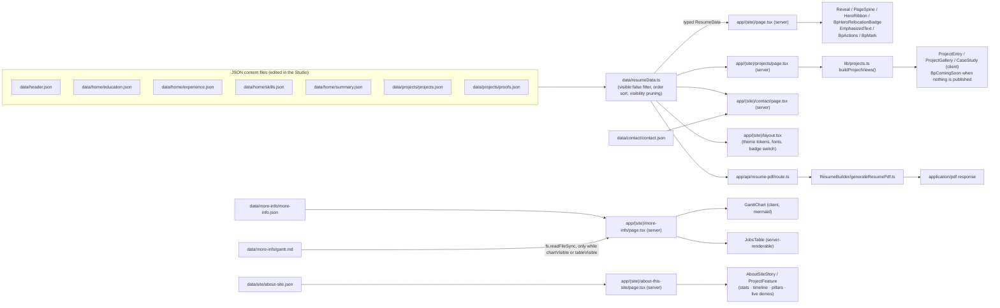

# Architecture and Data Flow

## Stack

- **Next.js `^16.2.12`**, App Router (`app/` directory), Turbopack in dev
- **React** `latest` + **TypeScript** `strict: true`
- **framer-motion** — `Reveal` entrances, the scroll-spring spines (`PageSpine`, `ProjectListSpine`), the relocation badge's hop, `CountUp` / `ScrollWords`, the project entries, gallery wipes and case-study expansion, and the About page's timeline and demos ([[Blueprint UI Components]], [[Projects Route (BpComingSoon)]], [[About This Site Page]])
- **lucide-react** — one icon (`ExternalLink`) in `JobsTable`
- **mermaid** — renders the job-tracker Gantt chart client-side ([[GanttChart JobsTable and gantt.ts]])
- **jsPDF** — generates the downloadable resume PDF server-side ([[Resume PDF Pipeline]])
- **@vercel/analytics** + **@vercel/speed-insights** — mounted in the root `app/layout.tsx`
- **next/font/google** — eight faces preloaded as CSS variables in `app/(site)/layout.tsx` (Instrument Serif, Spectral, Playfair Display, Fraunces, Source Serif 4, Inter, Space Grotesk, IBM Plex Mono); `header.json.fonts` picks which one fills `--bp-font-header` / `--bp-font-subheader` / `--bp-font-body`. **next/og** + a bundled TTF render the OG image and apple icon
- **playwright-core** (dev only) — drives the machine's own Chrome/Edge for `scripts/capture-site-screenshots.mjs` and `scripts/check-anchor-hydration.mjs`; never part of the site bundle

## Two-layer layout

- **`app/layout.tsx`** (root) — shell only: `<html>`/`<body>`, imports `app/base.css` (a bare reset), mounts Analytics + SpeedInsights, and sets static `metadata` (title, description, OpenGraph, Twitter, `metadataBase`). No chrome, no fonts.
- **`app/(site)/layout.tsx`** — the visible site: loads the eight Google faces as CSS variables, imports `app/(site)/blueprint.css`, resolves the Studio's palette choice (`lib/theme.ts` → `resolveThemeTokens(resumeData.theme)`) and the font roles into a `<style>` override on `.bp[data-theme-id]` (light) and `html[data-theme="dark"] .bp[data-theme-id]` (dark), wraps everything in `ThemeProvider`, and renders `<BpNav>` above `{children}` and `<BpFixedRelocationBadge>` below (docked bottom-right on every page except `/`, whose hero owns its own badge), plus `<StudioLink>` in development only (the "Edit in Studio" control, see [[Blueprint UI Components]]). Every page route lives in this `(site)` group.

## Data flow, end to end

## The central merge: `data/resumeData.ts`

Every page except More Info and About this site imports one module — `@/data/resumeData` — which:

1. Imports `header.json`, the four `data/home/*.json` files, and the two `data/projects/*.json` files.
2. Drops every project and proof whose `visible` is `false` (the Studio's per-entry "draft" switch) and sorts the surviving projects by `order`.
3. Reads `header.json.visibility` (a `ResumeVisibility` object with 5 booleans) and uses it to **conditionally strip** `proofId`/`projectId` off experience bullets (`emphasis` phrases always pass through), and to zero out the `proofs`/`projects` arrays if nothing needs them.
4. Assembles and exports a single typed `ResumeData` constant — `person`, `visibility`, `theme`, `fonts`, `resumePdfPath` straight off the header, the rest merged.

Current flag values (`header.json`): `experienceProjectButtons: true`, `experienceProofButtons: false`, `projectsSection: true`, `proofIndex: false`, `openToRelocation: true`. Net effect on `main`:

- Experience bullets keep their `projectId` (four Proteor bullets carry one) and lose their `proofId`. The home page turns a kept `projectId` into an inline evidence link ("see ICARUS-Lite ↗" → `/projects#project-icarus-lite`) — but only when the id belongs to a *published* project, so today exactly one bullet links out; the other three point at drafts.
- `includeProofData` is `true` (`projectsSection` counts, since the projects page uses proofs as its case-study detail layer) — yet every one of the 17 entries in `proofs.json` is `visible: false`, so `resumeData.proofs` is still `[]` at runtime. Case studies come from each project's own `additionalInfo` instead.
- `includeProjectData` is `true` → `resumeData.projects` is the published list: one project (`icarus-lite`); the other eight are `visible: false` drafts.
- `openToRelocation` shows the relocation badge (hero on `/`, docked elsewhere) and the "Open to relocation" line in the contact hero.

These are **build-time content toggles**, flipped in the Studio's Site Settings, not runtime UI toggles. See [[Data Layer and Types]] for the exact logic.

## Server vs. client components

- `app/layout.tsx`, `app/(site)/layout.tsx`, and all five `app/(site)/**/page.tsx` files are **server components** (no `"use client"`). `more-info/page.tsx` additionally reads `data/more-info/gantt.md` off disk with Node's `fs` at request time (only while `ganttSection.chartVisible` or `tableVisible` is on); `page.tsx` calls `lib/build-stamp.ts` (git / `VERCEL_GIT_COMMIT_SHA`) for the footer's revision line.
- Client components (`"use client"`): everything under `components/blueprint/` except `BpMark` (`BpNav`, `BpThemeToggle`, `ThemeProvider`, `BpActions`, `BpComingSoon`, `Reveal`, `PageSpine`, `HeroRibbon`, `BackToTop`, `BpRelocationBadge`, `CountUp`, `WordReveal`, `ScrollWords`), `GanttChart`, `AboutSiteStory`, and the `components/projects/` tree (`ProjectEntry`, `ProjectListSpine`, `ProjectDateBox`, `ProjectGallery`, `Lightbox`, `ProjectFeature` and its `feature/*` blocks and demos). No directive, so server-renderable: `BpMark` (a pure SVG function used from both trees), `JobsTable`, `EmphasizedText`, `CaseStudy`, `ThemedShot`.
- `mermaid` is loaded with a dynamic `import("mermaid")` inside `GanttChart`'s `useEffect`, so it never ships in the initial bundle.
- `BpActions` dynamically imports `ResumeBuilder/downloadPublishedResume` only when the Download button is clicked.

## The two independent PDF paths

Two unrelated PDF-generation systems — don't conflate them:

1. **Live, data-driven, on demand**: `/api/resume-pdf` → `generateResumePdf.ts`, built from the exact `resumeData` the website renders. This is what the "Download PDF" button produces.
2. **Static, hand-tuned, per-application**: the PDFs in `1.ApplicationsUsed/` and `output/pdf/`, produced by manually invoking the `custom-resume` agent procedure against a specific posting in `2.JobsApplliedTo/`. Same jsPDF layout language, generated separately and tailored per job.

Full detail in [[Resume PDF Pipeline]] and [[Job Application Tracker]].

## Related
- [[Project Overview]]
- [[Data Layer and Types]]
- [[Repository Map]]
- [[Home]]
