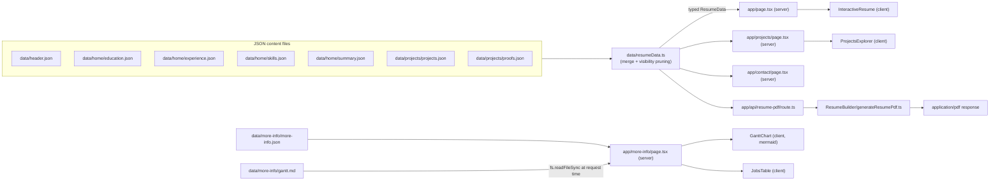

# Architecture and Data Flow

## Stack

- **Next.js `^16.2.12`**, App Router (`app/` directory)
- **React** `latest` + **TypeScript** `strict: true`
- **framer-motion** — drawer/lightbox/gallery animations
- **lucide-react** — icon set used across every interactive component
- **mermaid** — renders the job-tracker Gantt chart client-side ([[BulletList GanttChart and JobsTable]])
- **jsPDF** — generates the downloadable resume PDF server-side ([[Resume PDF Pipeline]])
- **@vercel/analytics** + **@vercel/speed-insights** — mounted globally in `app/layout.tsx`

## Data flow, end to end

## The central merge: `data/resumeData.ts`

Every page (except More Info) imports one module — `@/data/resumeData` — which:

1. Imports `header.json` and the four `data/home/*.json` files plus the two `data/projects/*.json` files.
2. Reads `header.json.visibility` (a `ResumeVisibility` object with 4 booleans) and uses it to **conditionally strip** `proofId`/`projectId` off experience bullets, and to zero out the entire `proofs`/`projects` arrays if nothing needs them.
3. Assembles and exports a single typed `ResumeData` object.

This means the visibility flags are a **build-time content toggle**, not a runtime UI toggle — flip a flag in `header.json`, and the proof/project chips and panels disappear from every page that reads `resumeData`, and the pruned proof/project arrays are simply not present in the object at all (not just hidden in CSS). See [[Data Layer and Types]] for the exact flag list and current values.

## Server vs. client components

- `app/layout.tsx`, `app/page.tsx`, `app/projects/page.tsx`, `app/contact/page.tsx`, `app/more-info/page.tsx` are **server components** (no `"use client"`) — they import data directly (including, for More Info, reading `data/more-info/gantt.md` off disk with Node's `fs` at request time) and pass it down as props.
- Every component that needs interactivity, state, animation, or browser APIs is marked `"use client"`: `InteractiveResume`, `SiteHeader`, `ProjectsExplorer`, `ProjectDetails.tsx`'s three exports, `BulletList`, `GanttChart`. `JobsTable` has no `"use client"` directive but is only ever rendered from the client-composed More Info tree.
- `mermaid` is imported with a dynamic `import("mermaid")` inside `GanttChart`'s `useEffect`, so it never ships in the initial server-rendered bundle.
- The PDF download button in `InteractiveResume` dynamically imports `ResumeBuilder/downloadPublishedResume` only when clicked, keeping that code out of the main bundle too.

## The two independent PDF paths

There are **two unrelated PDF-generation systems** in this repo — don't conflate them:

1. **Live, data-driven, on demand**: `/api/resume-pdf` → `generateResumePdf.ts`, built from the exact same `resumeData` the website renders. This is what the "Download PDF" button on the site produces.
2. **Static, hand-tuned, per-application**: the PDFs in `output/ApplicationsUsed/` and `output/pdf/`, produced by manually invoking the `custom-resume` agent skill against a specific job posting in `JobsAppliedTo/`. These are visually similar (same jsPDF-based layout language) but generated separately and tailored per job.

Full detail in [[Resume PDF Pipeline]] and [[Job Application Tracker]].

## Related
- [[Project Overview]]
- [[Data Layer and Types]]
- [[Repository Map]]
- [[Home]]
