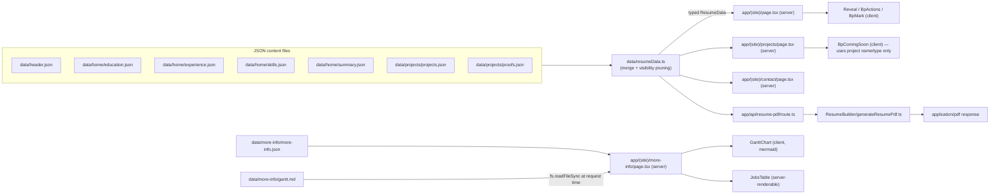

# Architecture and Data Flow

## Stack

- **Next.js `^16.2.12`**, App Router (`app/` directory), Turbopack in dev
- **React** `latest` + **TypeScript** `strict: true`
- **framer-motion** — the `Reveal` scroll-entrance wrapper only ([[Blueprint UI Components]])
- **lucide-react** — one icon (`ExternalLink`) in `JobsTable`
- **mermaid** — renders the job-tracker Gantt chart client-side ([[GanttChart JobsTable and gantt.ts]])
- **jsPDF** — generates the downloadable resume PDF server-side ([[Resume PDF Pipeline]])
- **@vercel/analytics** + **@vercel/speed-insights** — mounted in the root `app/layout.tsx`
- **next/font/google** (Instrument Serif, Spectral) loaded in `app/(site)/layout.tsx`; **next/og** + a bundled TTF render the OG image and apple icon

## Two-layer layout

- **`app/layout.tsx`** (root) — shell only: `<html>`/`<body>`, imports `app/base.css` (a bare reset), mounts Analytics + SpeedInsights, and sets static `metadata` (title, description, OpenGraph, Twitter, `metadataBase`). No chrome, no fonts.
- **`app/(site)/layout.tsx`** — the visible site: loads the two Google fonts as CSS variables, imports `app/(site)/blueprint.css`, wraps children in `
`, and renders `<BpNav>` plus the fixed "Open to relocation" badge. Every page route lives in this `(site)` group.

## Data flow, end to end

## The central merge: `data/resumeData.ts`

Every page except More Info imports one module — `@/data/resumeData` — which:

1. Imports `header.json`, the four `data/home/*.json` files, and the two `data/projects/*.json` files.
2. Reads `header.json.visibility` (a `ResumeVisibility` object with 4 booleans) and uses it to **conditionally strip** `proofId`/`projectId` off experience bullets, and to zero out the `proofs`/`projects` arrays if nothing needs them.
3. Assembles and exports a single typed `ResumeData` constant.

Current flag values (`header.json`): `experienceProjectButtons: false`, `experienceProofButtons: false`, `projectsSection: true`, `proofIndex: false`. Net effect on `main`:

- Experience bullets are stripped of both `proofId` and `projectId`.
- `includeProofData` is `false` → `resumeData.proofs` is `[]` at runtime regardless of `proofs.json` (17 entries).
- `includeProjectData` is `true` (because `projectsSection`) → `resumeData.projects` is the full array, but the only consumer (`/projects`) reads just `name`, `type`, and `order` for its teaser list.

This is a **build-time content toggle**, not a runtime UI toggle. See [[Data Layer and Types]] for the exact logic.

## Server vs. client components

- `app/layout.tsx`, `app/(site)/layout.tsx`, and all four `app/(site)/**/page.tsx` files are **server components** (no `"use client"`). `more-info/page.tsx` additionally reads `data/more-info/gantt.md` off disk with Node's `fs` at request time.
- Client components (`"use client"`): `BpNav`, `BpActions`, `BpComingSoon`, `Reveal`, `GanttChart`. `BpMark` and `JobsTable` have no directive — `BpMark` is a pure SVG function used from both server and client trees; `JobsTable` is only rendered inside `more-info/page.tsx`.
- `mermaid` is loaded with a dynamic `import("mermaid")` inside `GanttChart`'s `useEffect`, so it never ships in the initial bundle.
- `BpActions` dynamically imports `ResumeBuilder/downloadPublishedResume` only when the Download button is clicked.

## The two independent PDF paths

Two unrelated PDF-generation systems — don't conflate them:

1. **Live, data-driven, on demand**: `/api/resume-pdf` → `generateResumePdf.ts`, built from the exact `resumeData` the website renders. This is what the "Download PDF" button produces.
2. **Static, hand-tuned, per-application**: the PDFs in `1.ApplicationsUsed/` and `output/pdf/`, produced by manually invoking the `custom-resume` agent procedure against a specific posting in `2.JobsApplliedTo/`. Same jsPDF layout language, generated separately and tailored per job.

Full detail in [[Resume PDF Pipeline]] and [[Job Application Tracker]].

## Related
- [[Project Overview]]
- [[Data Layer and Types]]
- [[Repository Map]]
- [[Home]]
