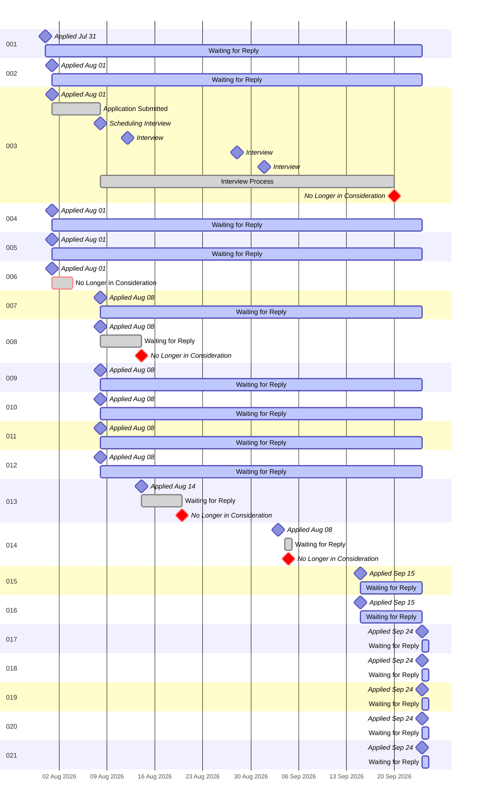

# RileyBeenders.com
#### Version 3.3 released on September 20th, 2026.

***

'RileyBeenders.com' is a resume-shaped portfolio website designed to complement a traditional ATS-friendly resume PDF. The PDF remains the official application document, while the website serves as an interactive evidence layer that demonstrates the work behind the claims on the resume.

The site stays readable as a conventional resume at rest, then reveals additional proof of work through hover states, subtle mouse-driven 3D motion, persistent project links, and expandable information drawers. Its goal is to preserve the clarity and familiarity of a standard resume while giving visitors a more engaging way to explore projects, supporting visuals, and professional impact.

## Job Application Tracker



**Status Key**
- 🟢 = Application Received
- 🟠 = Currently in the interview process
- 🔴 = No longer in consideration

| ID | Job Title | Company | Location (Goal) | Date Submitted | Resume Used | Status | Job ID |
| :----: | :---- | :---- | :----: | :----: | :----: | :----: | :----: |
| 001 | [Principal Ride Control Software Engineer (Controls Automation)](https://github.com/RileyBeenders/rileybeenders.com/blob/main/2.JobsApplliedTo/001_Principal%20Ride%20Control%20Software%20Engineer%20%28Controls%20Automation%29%20at%20DISNEY%20-%20073126.pdf) | Walt Disney Imagineering | Glendale, CA | July 31, 2026 | [Tailored Resume](https://github.com/RileyBeenders/rileybeenders.com/blob/main/1.ApplicationsUsed/001_Riley_Beenders_Disney_Principal_Ride_Control_Software_Engineer_Resume.pdf) | 🟢 | 10144760 |
| 002 | [General Application](https://github.com/RileyBeenders/rileybeenders.com/blob/main/2.JobsApplliedTo/002_General%20Application%20at%20Fluidstack.pdf) | Fluidstack.io | Unknown ATM | August 01, 2026 | [Website Generated](https://github.com/RileyBeenders/rileybeenders.com/blob/main/1.ApplicationsUsed/000_Riley-Beenders-Resume_080126.pdf) | 🟢 | N/A |
| 003 | [Principal Electro-Mechanical Manufacturing Engineer](https://github.com/RileyBeenders/rileybeenders.com/blob/main/2.JobsApplliedTo/003_Principal%20Electro-Mechanical%20Manufacturing%20Engineer%20at%20K2%20Space.pdf) | K2 Space | Los Angeles, CA | August 01, 2026 | [Website Generated](https://github.com/RileyBeenders/rileybeenders.com/blob/main/1.ApplicationsUsed/000_Riley-Beenders-Resume_080126.pdf) | 🔴 | N/A |
| 004 | [Lead, Manufacturing Engineer, Integration & Test](https://github.com/RileyBeenders/rileybeenders.com/blob/main/2.JobsApplliedTo/004_Lead%2C%20Manufacturing%20Engineer%2C%20Integration%20%26%20Test%20at%20Relativity%20Space.pdf) | Relativity Space | Long Beach, CA | August 01, 2026 | [Website Generated](https://github.com/RileyBeenders/rileybeenders.com/blob/main/1.ApplicationsUsed/000_Riley-Beenders-Resume_080126.pdf) | 🟢 | N/A |
| 005 | [Sr. Network Security Engineer](https://github.com/RileyBeenders/rileybeenders.com/blob/main/2.JobsApplliedTo/005_Sr.%20Network%20Security%20Engineer%20at%20SpaceX.pdf) | SpaceX | Hawthorne, CA | August 01, 2026 | [Tailored Resume](https://github.com/RileyBeenders/rileybeenders.com/blob/main/1.ApplicationsUsed/005_RileyBeenders_SpaceX_Sr_Network_Security_Engineer.pdf) | 🟢 | N/A |
| 006 | [Principal Software Engineer](https://github.com/RileyBeenders/rileybeenders.com/blob/main/2.JobsApplliedTo/006_Principal%20Software%20Engineer%20at%20Disney.pdf) | Walt Disney Imagineering | Glendale, CA | August 01, 2026 | [Tailored Resume](https://github.com/RileyBeenders/rileybeenders.com/blob/main/1.ApplicationsUsed/006_RileyBeenders_Disney_Principal_Software_Engineer.pdf) | 🔴 | 10153541 |
| 007 | [Senior Staff Manufacturing Engineer](https://github.com/RileyBeenders/rileybeenders.com/blob/main/2.JobsApplliedTo/007_Senior%20Staff%20Manufacturing%20Engineer%20at%20Boston%20Dynamics.pdf) | Boston Dynamics | Waltham, MA | August 08, 2026 | [Tailored Resume](https://github.com/RileyBeenders/rileybeenders.com/blob/main/1.ApplicationsUsed/007_Riley%20Beenders_Senior%20Staff%20Manufacturing%20Engineer_20260808.pdf) | 🟢 | R2966 |
| 008 | [Staff Manufacturing Engineering - Atlas](https://github.com/RileyBeenders/rileybeenders.com/blob/main/2.JobsApplliedTo/008_Staff%20Manufacturing%20Engineering%20-%20Atlas%20at%20Boston%20Dynamics.pdf) | Boston Dynamics | Waltham, MA | August 08, 2026 | [Tailored Resume](https://github.com/RileyBeenders/rileybeenders.com/blob/main/1.ApplicationsUsed/008_Riley%20Beenders_Staff%20Manufacturing%20Engineering%20-%20Atlas_20260808.pdf) | 🔴 | R2864 |
| 009 | [Manufacturing Engineer](https://github.com/RileyBeenders/rileybeenders.com/blob/main/2.JobsApplliedTo/009_Job%20Application%20for%20Manufacturing%20Engineer%20at%20Figure.pdf) | Figure Robotics | San Jose, CA | August 08, 2026 | [Tailored Resume](https://github.com/RileyBeenders/rileybeenders.com/blob/main/1.ApplicationsUsed/009_Riley%20Beenders_Manufacturing%20Engineer_20260808.pdf) | 🟢 | N/A |
| 010 | [NPI Engineer](https://github.com/RileyBeenders/rileybeenders.com/blob/main/2.JobsApplliedTo/010_Job%20Application%20for%20NPI%20Engineer%20at%20Figure.pdf) | Figure Robotics | San Jose, CA | August 08, 2026 | [Tailored Resume](https://github.com/RileyBeenders/rileybeenders.com/blob/main/1.ApplicationsUsed/010_Riley%20Beenders_NPI%20Engineer_20260808.pdf) | 🟢 | N/A |
| 011 | [Mechanical Engineer - Integration & Test](https://github.com/RileyBeenders/rileybeenders.com/blob/main/2.JobsApplliedTo/011_Job%20Application%20for%20Mechanical%20Engineer%20-%20Integration%20%26%20Test%20at%20Figure.pdf) | Figure Robotics | San Jose, CA | August 08, 2026 | [Tailored Resume](https://github.com/RileyBeenders/rileybeenders.com/blob/main/1.ApplicationsUsed/011_Riley%20Beenders_Mechanical%20Engineer%20-%20Integration%20%26%20Test_20260808.pdf) | 🟢 | N/A |
| 012 | [Product Engineer, Global Manufacturing Engineering](https://github.com/RileyBeenders/rileybeenders.com/blob/main/2.JobsApplliedTo/012_Product%20Engineer%2C%20Global%20Manufacturing%20Engineering%20-%20Google%20Careers.pdf) | Google | Atlanta, GA | August 08, 2026 | [Tailored Resume](https://github.com/RileyBeenders/rileybeenders.com/blob/main/1.ApplicationsUsed/012_Riley%20Beenders_Product%20Engineer%2C%20Global%20Manufacturing%20Engineering_20260808.pdf) | 🟢 | N/A |
| 013 | [Product Software Engineer I](https://github.com/RileyBeenders/rileybeenders.com/blob/main/2.JobsApplliedTo/013_Product%20Software%20Engineer%20I%20at%20DISNEY%20-%20Disney%20Careers.pdf) | Walt Disney Entertainment | Glendale, CA | August 14, 2026 | [Tailored Resume](https://github.com/RileyBeenders/rileybeenders.com/blob/main/1.ApplicationsUsed/013_RileyBeendersResume_Product%20Software%20Engineer%20I_20260814.pdf) | 🔴 | 10151599 |
| 014 | [WDI Figure Programming Intern, Spring 2027](https://github.com/RileyBeenders/rileybeenders.com/blob/main/2.JobsApplliedTo/014_WDI%20Figure%20Programming%20Intern%2C%20Spring%202027.pdf) | Walt Disney Imagineering | CA or FL | September 03, 2026 | [Tailored Resume](https://github.com/RileyBeenders/rileybeenders.com/blob/main/1.ApplicationsUsed/014_Riley-Beenders-Resume_080826.pdf) | 🔴 | 10159712 |
| 015 | [Forward Deployed Engineer](https://github.com/RileyBeenders/rileybeenders.com/blob/main/2.JobsApplliedTo/015_Forward%20Deployed%20Engineer%20at%20DISNEY.pdf) | The Walt Disney Company (Corporate) | Burbank / Glendale, CA | September 15, 2026 | [Tailored Resume](https://github.com/RileyBeenders/rileybeenders.com/blob/main/1.ApplicationsUsed/015_RileyBeenders_Disney_Forward_Deployed_Engineer.pdf) | 🟢 | 10155880 |
| 016 | [Forward Deployed Product Engineer](https://github.com/RileyBeenders/rileybeenders.com/blob/main/2.JobsApplliedTo/016_Forward%20Deployed%20Product%20Engineer%20at%20DISNEY.pdf) | The Walt Disney Company (Corporate) | Burbank / Glendale, CA | September 15, 2026 | [Tailored Resume](https://github.com/RileyBeenders/rileybeenders.com/blob/main/1.ApplicationsUsed/016_RileyBeenders_Disney_Forward_Deployed_Product_Engineer.pdf) | 🟢 | 10158258 |
| 017 | [Sr Cybersecurity Engineer](https://github.com/RileyBeenders/rileybeenders.com/blob/main/2.JobsApplliedTo/017_Disney_Sr%20Cybersecurity%20Engineer.pdf) | Disneyland Resort | Anaheim, CA | September 24, 2026 | [Tailored Resume](https://github.com/RileyBeenders/rileybeenders.com/blob/main/1.ApplicationsUsed/017_RileyBeenders_Disney_Sr_Cybersecurity_Engineer_2-Page.pdf) | 🟢 | 10157360 |
| 018 | [Sr Mechanical Engineer](https://github.com/RileyBeenders/rileybeenders.com/blob/main/2.JobsApplliedTo/018_Disney_Sr%20Mechanical%20Engineer.pdf) | Disneyland Resort | Anaheim, CA | September 24, 2026 | [Tailored Resume](https://github.com/RileyBeenders/rileybeenders.com/blob/main/1.ApplicationsUsed/018_RileyBeenders_Disney_Sr_Mechanical_Engineer_2-Page.pdf) | 🟢 | 10161142 |
| 019 | [Sr Site Reliability Engineer](https://github.com/RileyBeenders/rileybeenders.com/blob/main/2.JobsApplliedTo/019_Disney_Sr%20Site%20Reliability%20Engineer.pdf) | Disney Signature Experiences | Celebration, FL | September 24, 2026 | [Tailored Resume](https://github.com/RileyBeenders/rileybeenders.com/blob/main/1.ApplicationsUsed/019_RileyBeenders_Disney_Sr_Site_Reliability_Engineer_2-Page.pdf) | 🟢 | 10160567 |
| 020 | [Manager, Software Engineering](https://github.com/RileyBeenders/rileybeenders.com/blob/main/2.JobsApplliedTo/020_Disney_Manager%2C%20Software%20Engineering.pdf) | Disney Experiences | Orlando, FL | September 24, 2026 | [Tailored Resume](https://github.com/RileyBeenders/rileybeenders.com/blob/main/1.ApplicationsUsed/020_RileyBeenders_Disney_Manager_Software_Engineering_2-Page.pdf) | 🟢 | 10158386 |
| 021 | [Manager, Systems Engineering (DCL New Build)](https://github.com/RileyBeenders/rileybeenders.com/blob/main/2.JobsApplliedTo/021_Disney_Manager%2C%20Systems%20Engineering%20%28DCL%20New%20Build%29.pdf) | Disney Signature Experiences (Disney Cruise Line) | Celebration, FL | September 24, 2026 | [Tailored Resume](https://github.com/RileyBeenders/rileybeenders.com/blob/main/1.ApplicationsUsed/021_RileyBeenders_Disney_Senior_Manager_Solutions_Architecture_2-Page.pdf) | 🟢 | 10160198 |

***

### Running the Local Environment

```bash
npm install
npm run site
```

One command brings up both halves of the local environment and stops both on
Ctrl+C:

| | URL | What it is |
| :-- | :-- | :-- |
| **Site** | `http://localhost:3000` | `next dev` with Fast Refresh, behind the device gate (below) |
| **Studio** | `http://localhost:3001` | the content editor, reachable from this machine only |

If you are running these commands in Windows PowerShell and see `running scripts is disabled on this system`, use the command shim instead:

```bash
npm.cmd install
npm.cmd run site
```

If you want to keep using `npm` directly in PowerShell, run this once in an elevated terminal:

```powershell
Set-ExecutionPolicy -Scope CurrentUser RemoteSigned
```

**Moving between the two.** Every page of the dev site has an **Edit in Studio**
control in its bottom-right corner that opens the Studio on the file that page
is built from (and on the project entry, when the URL names one). The Studio's
**Open on the site** button is the way back. Each direction reuses one window,
so neither side multiplies into tabs and unsaved Studio work is never lost.

**Testing on a phone or tablet.** The dev server listens only on this machine;
the gate on port 3000 is what other devices reach, and it turns them away until
you let them in:

1. On the phone, open the address the terminal printed at startup
   (`http://<this machine's LAN IP>:3000`). It shows a "not allowed in yet" page
   with the phone's address.
2. In the Studio, open **Devices**. The phone is listed under *Waiting at the
   door* — click **Allow**. The page on the phone loads the site by itself.

Access is temporary (1 hour to 24 hours, or until the server stops) and can be
revoked from the same panel. Only local-network addresses can be allowed, a
range no wider than one network (`10.1.1.0/24`) is the most a grant can cover,
and nothing off the local network gets in at all. The list lives in the
git-ignored `.studio-access.json`.

Each half also runs on its own: `npm run dev` for the site alone (loopback only,
no gate, no Studio control) and `npm run studio` for the editor alone. Ports can
be moved with `SITE_PORT`, `STUDIO_PORT`, and `NEXT_PORT` (the private port
`next dev` listens on behind the gate, 3010).

***

### Editing Content — the Studio

Site content lives in the JSON files under `data/`. Rather than editing those by
hand, use the Studio: a local editor that reads and writes the same files
through a browser. It starts with `npm run site` (or alone with `npm run studio`)
at `http://localhost:3001`; save there, and the site on port 3000 hot-reloads
with the change.

- **Local only.** The Studio is a standalone Node server; it is not part of the
  Next app and never ships to production. It binds to the loopback interface, so
  nothing outside the machine can reach it — not even a device you have allowed
  onto the dev site.
- **Projects and proofs** get a purpose-built editor: reorder them, edit bullets,
  build the image gallery, and cross-link a project to its proof.
- **Show / hide.** The eye icon next to a project or proof writes
  `"visible": false` into the JSON. The entry stays in the file — and in the
  Studio — but drops off the public site. History is kept; visibility is not.
- **Images.** Upload straight into `public/project-images` or
  `public/project-artifacts`, or pick from what is already there. The editor
  shows every image as a small resized copy sized to its box (cached in the
  git-ignored `.studio-cache/`), never the multi-megabyte original.
- **Saves are guarded.** Every save writes the previous version into
  `.studio-backups/` (git-ignored, last 25 kept), and a save is refused if the
  file changed on disk since it was loaded.
- **Devices.** The panel that lets a phone or another machine on the local
  network open the dev site for a while — see *Testing on a phone or tablet*
  above.

***

### Tailored Resume Builder

Each application gets its own resume, written for that one posting. The builder
is an agent skill, `custom-resume` (`.agents/skills/custom-resume/SKILL.md`),
not a script: run `/custom-resume` in Claude Code (or `$custom-resume` in Codex)
from the repo root. The agent lays the resume out as an HTML page and prints it
to PDF with headless Chrome. It never touches the site's own `/api/resume-pdf`
generator.

- **Two questions first.** It asks how many pages the resume should be
  (1 is recommended) and which posting in `2.JobsApplliedTo/` to use. Nothing
  starts until it has both. Near-miss folder spellings such as `JobsAppliedTo`
  still resolve.
- **Reads the posting.** It pulls the company, title, location,
  responsibilities, qualifications, and the keywords the posting repeats or
  stresses. Where the posting and `data/home/skills.json` spell a skill
  differently, the resume uses the posting's wording.
- **Evidence only.** Every claim is checked against the live site and the same
  JSON the site is built from: `data/header.json`, `data/home/*.json`, and
  `data/projects/projects.json`. It can reword a real claim to match the
  posting, but tools, credentials, industries, dates, or metrics the data
  doesn't support are left out and listed as gaps. When an older resume
  disagrees with the current data, the current data wins.
- **Fills the pages.** The last page should end near the bottom margin, not
  halfway down. It adds supported content first (more experience bullets,
  Filament Innovations split into its separate roles, a Selected Projects
  section, the full certification list), then scales every vertical gap
  together, about 0.8x to 1.7x the reference spacing. It never shrinks the body
  text and never pads. If the evidence runs out, it says so.
- **Same look every time.** Layout follows the reference resume
  `output/pdf/Riley_Beenders_Disney_Principal_Ride_Control_Software_Engineer_Resume_v2.pdf`:
  US Letter, one column, Arial, navy headings, with the phone, email, website,
  and LinkedIn links in blue and underlined. On multi-page resumes a heading
  always stays with its first bullet, and a bullet never splits across pages.
- **Checked before delivery.** Exact page count at 612 x 792 pt, the lowest
  line on the last page at y >= 726 pt, every link clickable, no clipping or
  overlap, the posting's supported keywords present, and none of the gaps
  slipped back in. It returns the PDF link with the measured page fill.
- **Where the files go.** The resume is saved to `output/pdf/` as
  `RileyBeenders_<Company>_<Job_Title>.pdf` (`_2-Page` is appended for 2-page
  versions). The copy actually submitted goes into `1.ApplicationsUsed/` with the
  application's ID in front (for example `019_...`). The tracker above and the
  application's page in the Obsidian vault are then updated through the
  `sync-charts` and `vault-sync` skills.
