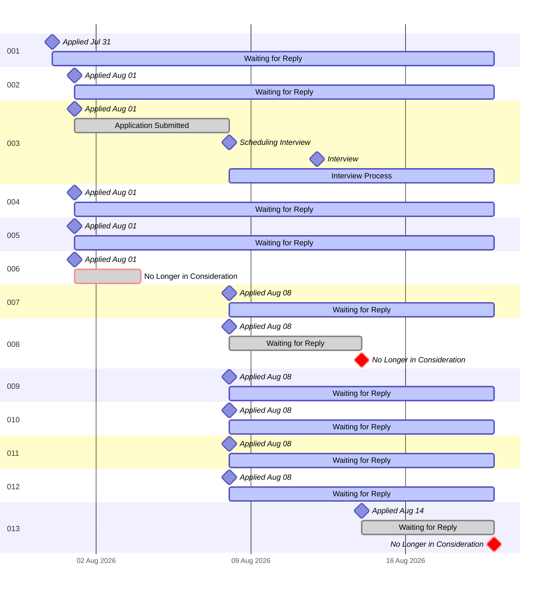

| JobID | Job Title | Company | Location (Goal) | Date Submitted | Resume Used | Updates |
| :----: | :---- | :---- | :----: | :----: | :----: | :---- |
| 001 | [Principal Ride Control Software Engineer (Controls Automation)](https://github.com/RileyBeenders/rileybeenders.com/blob/Version-2.0/2.JobsAPlliedTo/001_Principal%20Ride%20Control%20Software%20Engineer%20(Controls%20Automation)%20at%20DISNEY%20-%20073126.pdf) | Walt Disney Imagineering | Glendale, CA | July 31, 2026 | [Tailored Resume](https://github.com/RileyBeenders/rileybeenders.com/blob/Version-2.0/1.ApplicationsUsed/001_Riley_Beenders_Disney_Principal_Ride_Control_Software_Engineer_Resume.pdf) | 🟢 Application Received |
| 002 | [General Application](https://github.com/RileyBeenders/rileybeenders.com/blob/Version-2.0/2.JobsAPlliedTo/002_General%20Application%20at%20Fluidstack.pdf) | Fluidstack.io | Unknown ATM | August 01, 2026 | [Website Generated](https://github.com/RileyBeenders/rileybeenders.com/blob/Version-2.0/1.ApplicationsUsed/Riley-Beenders-Resume_080126.pdf) | 🟢 Application Received |
| 003 | [Principal Electro-Mechanical Manufacturing Engineer](https://github.com/RileyBeenders/rileybeenders.com/blob/Version-2.0/2.JobsAPlliedTo/003_Principal%20Electro-Mechanical%20Manufacturing%20Engineer%20at%20K2%20Space.pdf) | K2 Space | Los Angeles, CA | August 01, 2026 | [Website Generated](https://github.com/RileyBeenders/rileybeenders.com/blob/Version-2.0/1.ApplicationsUsed/Riley-Beenders-Resume_080126.pdf) | 🟡 Interviewing |
| 004 | [Lead, Manufacturing Engineer, Integration & Test](https://github.com/RileyBeenders/rileybeenders.com/blob/Version-2.0/2.JobsAPlliedTo/004_Lead%2C%20Manufacturing%20Engineer%2C%20Integration%20%26%20Test%20at%20Relativity%20Space.pdf) | Relativity Space | Long Beach, CA | August 01, 2026 | [Website Generated](https://github.com/RileyBeenders/rileybeenders.com/blob/Version-2.0/1.ApplicationsUsed/Riley-Beenders-Resume_080126.pdf) | 🟢 Application Received |
| 005 | [Sr. Network Security Engineer](https://github.com/RileyBeenders/rileybeenders.com/blob/Version-2.0/2.JobsAPlliedTo/005_Sr.%20Network%20Security%20Engineer%20at%20SpaceX.pdf) | SpaceX | Hawthorne, CA | August 01, 2026 | [Tailored Resume](https://github.com/RileyBeenders/rileybeenders.com/blob/Version-2.0/1.ApplicationsUsed/005_RileyBeenders_SpaceX_Sr_Network_Security_Engineer.pdf) | 🟢 Application Received |
| 006 | [Principal Software Engineer](https://github.com/RileyBeenders/rileybeenders.com/blob/Version-2.0/2.JobsAPlliedTo/006_Principal%20Software%20Engineer%20at%20Disney.pdf) | Walt Disney Imagineering | Glendale, CA | August 01, 2026 | [Tailored Resume](https://github.com/RileyBeenders/rileybeenders.com/blob/Version-2.0/1.ApplicationsUsed/006_RileyBeenders_Disney_Principal_Software_Engineer.pdf) | 🔴 No longer in consideration [August 4, 2026] |
| 007 | [Senior Staff Manufacturing Engineer](https://github.com/RileyBeenders/rileybeenders.com/blob/Version-2.0/2.JobsAPlliedTo/007_Senior%20Staff%20Manufacturing%20Engineer%20at%20Boston%20Dynamics.pdf) | Boston Dynamics | Waltham, MA | August 08, 2026 | [Tailored Resume](https://github.com/RileyBeenders/rileybeenders.com/blob/Version-2.0/1.ApplicationsUsed/007_Riley%20Beenders_Senior%20Staff%20Manufacturing%20Engineer_20260808.pdf) | 🟢 Application Received |
| 008 | [Staff Manufacturing Engineering - Atlas](https://github.com/RileyBeenders/rileybeenders.com/blob/Version-2.0/2.JobsAPlliedTo/008_Staff%20Manufacturing%20Engineering%20-%20Atlas%20at%20Boston%20Dynamics.pdf) | Boston Dynamics | Waltham, MA | August 08, 2026 | [Tailored Resume](https://github.com/RileyBeenders/rileybeenders.com/blob/Version-2.0/1.ApplicationsUsed/008_Riley%20Beenders_Staff%20Manufacturing%20Engineering%20-%20Atlas_20260808.pdf) | 🔴 No longer in consideration [August 14, 2026] |
| 009 | [Manufacturing Engineer](https://github.com/RileyBeenders/rileybeenders.com/blob/Version-2.0/2.JobsAPlliedTo/009_Job%20Application%20for%20Manufacturing%20Engineer%20at%20Figure.pdf) | Figure Robotics | San Jose, CA | August 08, 2026 | [Tailored Resume](https://github.com/RileyBeenders/rileybeenders.com/blob/Version-2.0/1.ApplicationsUsed/009_Riley%20Beenders_Manufacturing%20Engineer_20260808.pdf) | 🟢 Application Received |
| 010 | [NPI Engineer](https://github.com/RileyBeenders/rileybeenders.com/blob/Version-2.0/2.JobsAPlliedTo/010_Job%20Application%20for%20NPI%20Engineer%20at%20Figure.pdf) | Figure Robotics | San Jose, CA | August 08, 2026 | [Tailored Resume](https://github.com/RileyBeenders/rileybeenders.com/blob/Version-2.0/1.ApplicationsUsed/010_Riley%20Beenders_NPI%20Engineer_20260808.pdf) | 🟢 Application Received |
| 011 | [Mechanical Engineer - Integration & Test](https://github.com/RileyBeenders/rileybeenders.com/blob/Version-2.0/2.JobsAPlliedTo/011_Job%20Application%20for%20Mechanical%20Engineer%20-%20Integration%20%26%20Test%20at%20Figure.pdf) | Figure Robotics | San Jose, CA | August 08, 2026 | [Tailored Resume](https://github.com/RileyBeenders/rileybeenders.com/blob/Version-2.0/1.ApplicationsUsed/011_Riley%20Beenders_Mechanical%20Engineer%20-%20Integration%20%26%20Test_20260808.pdf) | 🟢 Application Received |
| 012 | [Product Engineer, Global Manufacturing Engineering](https://github.com/RileyBeenders/rileybeenders.com/blob/Version-2.0/2.JobsAPlliedTo/012_Product%20Engineer%2C%20Global%20Manufacturing%20Engineering%20%E2%80%94%20Google%20Careers.pdf) | Google | Atlanta, GA | August 08, 2026 | [Tailored Resume](https://github.com/RileyBeenders/rileybeenders.com/blob/Version-2.0/1.ApplicationsUsed/012_Riley%20Beenders_Product%20Engineer%2C%20Global%20Manufacturing%20Engineering_20260808.pdf) | 🟢 Application Received |
| 013 | [Product Software Engineer I](https://github.com/RileyBeenders/rileybeenders.com/blob/Version-2.0/2.JobsAPlliedTo/013_Product%20Software%20Engineer%20I%20at%20DISNEY%20-%20Disney%20Careers.pdf) | Walt Disney Entertainment | Glendale, CA | August 14, 2026 | [Tailored Resume](https://github.com/RileyBeenders/rileybeenders.com/blob/Version-2.0/1.ApplicationsUsed/013_RileyBeendersResume_Product%20Software%20Engineer%20I_20260814.pdf) | 🔴 No longer in consideration [August 20, 2026] |
